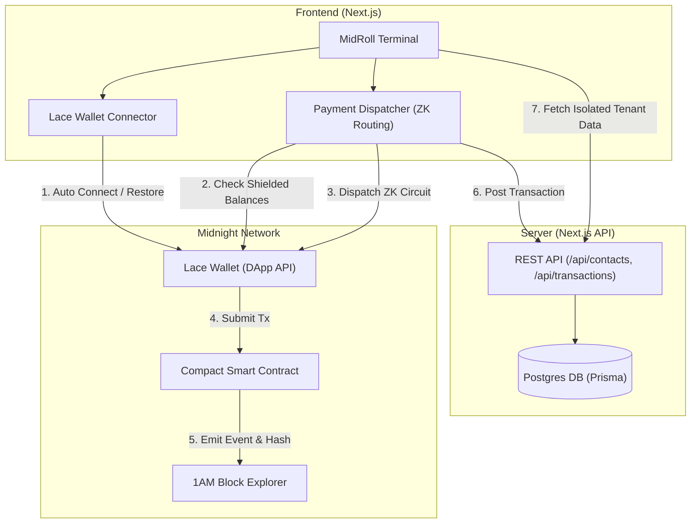
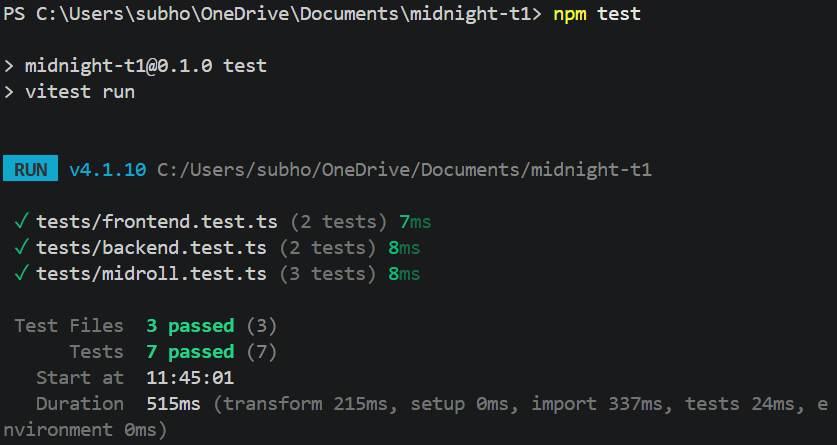

# 🌌 MidRoll: Privacy-First Corporate Expense & Governance on Midnight

MidRoll is a next-generation corporate expense reimbursement and employee governance platform built on the Midnight blockchain, leveraging Compact ZK smart contracts and Zero-Knowledge (ZK) proofs to ensure employee and financial privacy while providing high-fidelity corporate coordination.

[](https://midroll.netlify.app/)
[](https://github.com/Subho4531/midroll)
[](https://github.com/Subho4531/midroll/actions/workflows/ci.yml)


---


## 📑 Table of Contents

- [📖 Project Description](#-project-description)
- [🎥 Video Demo](#-video-demo)
- [✨ Key Features](#-key-features)
- [🏗️ Architecture](#-architecture)
- [📜 Smartcontract Details](#-smartcontract-details)
- [🛡️ Privacy & ZK Model](#-privacy--zk-model)
- [🌕 New Moon To Full Midnight Submission](#-new-moon-to-full-midnight-submission)
- [🚀 Run Locally & Getting Started](#-run-locally--getting-started)
- [🖼️ UI Screenshots & Testing Evidence](#-ui-screenshots--testing-evidence)
- [🛠️ Tech Stack](#-tech-stack)
- [📂 Project Structure](#-project-structure)
- [🤖 CI/CD Pipeline](#-cicd-pipeline)
- [📝 Product Proposal](#-product-proposal)

---

## 📖 Project Description
MidRoll enables decentralized organizations and companies to execute confidential employee workflows without exposing sensitive financial records on-chain:
- **Shielded Corporate Expense Reimbursements**: Employees submit zero-knowledge merchant receipt proofs attesting that expenses fall within category limits. Treasury disburses reimbursements directly to disposable stealth addresses without exposing itemized receipts, personal card numbers, or vendor details.
- **Anonymous Employee Governance & Whistleblower Protocol**: Employees verify payroll status via ZK witnesses to vote on company polls and submit encrypted internal compliance alerts without fear of employer retaliation or identity de-anonymization.

---

## 🎥 Video Demo

Experience MidRoll in action:

[](https://youtu.be/6HA7Y5ENZaU)

[Watch the MidRoll demo video](https://youtu.be/6HA7Y5ENZaU)
- **Direct YouTube URL:** https://youtu.be/6HA7Y5ENZaU

---

## ✨ Key Features

- **🔐 Privacy via ZK Proofs**: All compliance verification logic runs locally. Payouts are made directly to shielded/stealth addresses, hiding worker wallet histories.
- **💎 Dynamic Shielded Token Selection**: Integrates `getShieldedBalances` to query available shielded tokens in the connected Lace wallet dynamically, defaulting to custom USDC (`9e3544c9fc085f2be9625c3be78ce82a3cb3c5a946bbbf7553a21781ae4628dc`).
- **🔒 Company Multi-Tenant Isolation**: Roaster contacts, corporate teams, and on-chain logs are partitioned by the company connected `walletAddress` to enforce complete data privacy from other corporate tenants.
- **🛡️ Pending Transaction Recovery**: Handles indexer lag. Approved transactions are saved with a `PENDING` state and automatically synced/resolved chronologically against the connected wallet history on subsequent visits.
- **⚡ Auto-Connect & Redirect**: Connection persistence remembers your wallet connectivity; automatically connects on mount and redirects you directly to the `/dashboard`.

---

## 🏗️ Architecture



---

## 📜 Smartcontract Details

MidRoll's core logic is governed by a Compact smart contract deployed on the Midnight Preview Testnet.

- **Contract Address**: `d38ae623e782c47f2da8a2b1b29dc12e8a33082713caf42d09ab89afc3ec023f`
- **Network**: Midnight Preview Testnet
- **Midnight Explorer Link:** [https://www.midnightexplorer.com/tx/d38ae623e782c47f2da8a2b1b29dc12e8a33082713caf42d09ab89afc3ec023f](https://www.midnightexplorer.com/tx/d38ae623e782c47f2da8a2b1b29dc12e8a33082713caf42d09ab89afc3ec023f)
- **1AM Explorer Link:** [https://explorer.1am.xyz/tx/d38ae623e782c47f2da8a2b1b29dc12e8a33082713caf42d09ab89afc3ec023f](https://explorer.1am.xyz/tx/d38ae623e782c47f2da8a2b1b29dc12e8a33082713caf42d09ab89afc3ec023f)

---

## 🛡️ Privacy & ZK Model

### - PUBLIC:
- `treasury_commitment`: Hash commitment of corporate payroll treasury pool.
- `nullifier_root`: Set of spent nullifiers preventing double-claiming expenses & double-voting.
- `active_proposals_count`: Total active DAO governance polls.
- `aggregate_expense_disbursed`: Cumulative verified reimbursement payout.

### - PRIVATE:
- `salary_amount_cents`: Employee's raw monthly compensation rate.
- `employee_secret_key`: Secret key used for signing client-side ZK proofs.
- `receipt_itemized_details`: Raw itemized purchase items and merchant credit card data.
- `whistleblower_identity`: Employee name, IP address, and wallet address.

### - PROVED without revealing:
- Proves receipt total <= category policy limit.
- Proves active payroll membership to cast anonymous governance votes.
- Proves nullifier has not been spent previously.

### - Privacy Claim:
What an on-chain observer sees vs cannot see.
An on-chain observer can only see that a valid ZK transaction was executed, that the contract state commitment has updated, and that a proof has been successfully verified. An observer **cannot** see the worker's wallet address, the itemized receipt contents, the merchant's credit card information, the voter's identity, or the whistleblower's personal details.

---

## 🌕 New Moon To Full Midnight Submission

### 📁 Level 1 Verification

#### Requirements to Pass
| Requirement | Status | Evidence / Proof |
| --- | --- | --- |
| Toolchain installed & contract compiles via `compact compile` | **Fulfilled** | Compiled with Compact CLI. Proof: [contract_compile.png](./screenshots/contract_compile.png) |
| Passing test suite | **Fulfilled** | All Vitest tests compile and pass. Proof: [tests_passed.png](./screenshots/tests_passed.png) |
| Generated `managed/` directory present (circuits + keys) | **Fulfilled** | Directory present in [contracts/managed/](file:///C:/Users/subho/OneDrive/Documents/midnight-t1/contracts/managed/) |
| Contract deployed to Preview or Preprod with address | **Fulfilled** | Deployed on Preview testnet. Address: `d38ae623e782c47f2da8a2b1b29dc12e8a33082713caf42d09ab89afc3ec023f` |
| Initial product idea drafted in the README | **Fulfilled** | Detailed in [What This Does](#what-this-does) / [Project Description](#-project-description) |
| Minimum 5 meaningful commits | **Fulfilled** | 15+ commits logged. |

#### Submission Checklist
| Checklist Item | Status | Evidence / Link |
| --- | --- | --- |
| Public GitHub repository with a README.md | **Done** | [Subho4531/midroll](https://github.com/Subho4531/midroll) |
| Setup instructions (how to run locally) | **Done** | See [Setup & Run Locally](#setup--run-locally) |
| Screenshot: successful compile output | **Done** | [contract_compile.png](./screenshots/contract_compile.png) |
| Screenshot: contract deployed with address | **Done** | [contract_deploy.png](./screenshots/contract_deploy.png) |
| README section explaining public vs private witness | **Done** | See [Privacy Model](#-privacy--zk-model) |
| Initial product idea paragraph | **Done** | See [Project Description](#-project-description) |
| Minimum 5 meaningful commits | **Done** | Verified in Git logs. |

---

### 📁 Level 2 Verification

#### Requirements to Pass
| Requirement | Status | Evidence / Proof |
| --- | --- | --- |
| Lace wallet connect / disconnect implemented | **Fulfilled** | Implemented using DApp API inside [lace-wallet-context.tsx](file:///C:/Users/subho/OneDrive/Documents/midnight-t1/src/lib/lace-wallet-context.tsx) |
| Circuit called successfully from the frontend | **Fulfilled** | Called via `callCircuit` (dispatches payments/batch payments). Proof: [transactions.png](./screenshots/transactions.png) |
| An observable privacy behavior | **Fulfilled** | ZK proof generated locally proving payroll inclusion/receipt limits without exposing raw values on-chain. |
| Deployed to Preprod/Preview with verifiable address | **Fulfilled** | Deployed on Preview testnet. Address: `d38ae623e782c47f2da8a2b1b29dc12e8a33082713caf42d09ab89afc3ec023f` |
| Minimum 8 meaningful commits | **Fulfilled** | 15+ commits logged. |

#### Submission Checklist
| Checklist Item | Status | Evidence / Link |
| --- | --- | --- |
| Public GitHub repository with README | **Done** | [Subho4531/midroll](https://github.com/Subho4531/midroll) |
| Live demo link | **Done** | [midroll.netlify.app](https://midroll.netlify.app/) (URL: https://midroll.netlify.app/) |
| Deployed Preprod/Preview contract address | **Done** | `d38ae623e782c47f2da8a2b1b29dc12e8a33082713caf42d09ab89afc3ec023f` |
| Demo video: wallet connect + successful call | **Done** | [Watch Video](https://youtu.be/6HA7Y5ENZaU) (URL: https://youtu.be/6HA7Y5ENZaU) |
| README documenting the privacy claim | **Done** | See [Privacy Claim](#-privacy--zk-model) |
| Minimum 8 meaningful commits | **Done** | Verified in Git logs. |

---

### 📁 Level 3 Verification

#### Requirements to Pass
| Requirement | Status | Evidence / Proof |
| --- | --- | --- |
| Fully functional dApp meaningfully using Midnight’s privacy model | **Fulfilled** | Integrates private payroll validation, shielded payouts, and whistleblower gates. |
| Minimum 3 tests passing | **Fulfilled** | 7 tests passing. Proof: [tests_passed.png](./screenshots/tests_passed.png) |
| CI/CD pipeline running (workflow file + passing runs) | **Fulfilled** | Passing Actions runs. Workflow: [.github/workflows/ci.yml](file:///.github/workflows/ci.yml) |
| Approved idea submitted from the provided idea list | **Fulfilled** | Corporate payroll roaster and private employee governance. |
| Minimum 10 meaningful commits | **Fulfilled** | 15+ commits logged. |

#### Submission Checklist
| Checklist Item | Status | Evidence / Link |
| --- | --- | --- |
| Public GitHub repository with complete README | **Done** | [Subho4531/midroll](https://github.com/Subho4531/midroll) |
| Live demo link | **Done** | [midroll.netlify.app](https://midroll.netlify.app/) (URL: https://midroll.netlify.app/) |
| Screenshot: test output (3+ tests passing) | **Done** | [tests_passed.png](./screenshots/tests_passed.png) |
| CI/CD badge or workflow file with passing runs | **Done** | Badge above / workflow file: [.github/workflows/ci.yml](file:///.github/workflows/ci.yml) |
| Demo video (1 minute) showing full functionality | **Done** | [Watch Video](https://youtu.be/6HA7Y5ENZaU) (URL: https://youtu.be/6HA7Y5ENZaU) |
| README “privacy model” section | **Done** | See [Privacy Model](#-privacy--zk-model) |
| Product proposal submitted for approval | **Done** | [PROPOSAL.md](PROPOSAL.md)|
| Minimum 10 meaningful commits | **Done** | Verified in Git logs. |

---

## 🚀 Run Locally & Getting Started

### Prerequisites
- Lace Wallet browser extension installed (configured for Midnight Network)
- Node.js v22
- Docker (for running local dev proof server)

### Setup & Installation

1. **Clone the repository**:
   ```bash
   git clone https://github.com/Subho4531/midroll.git
   cd midroll
   ```

2. **Install dependencies**:
   ```bash
   npm install
   ```

3. **Start local Devnet Proof Server & Node**:
   ```bash
   npm run proof-server:start
   ```

4. **Deploy the Smart Contract**:
   To deploy to the local Devnet:
   ```bash
   npm run deploy
   ```
   To deploy to the public Preview network:
   ```bash
   npm run deploy --network preview
   ```

5. **Run the local development server**:
   ```bash
   npm run dev
   ```
   Open [http://localhost:3000](http://localhost:3000) in your browser.

---

## 🖼️ UI Screenshots & Testing Evidence

#### 🧪 Passed Vitest Test Suite (7/7 Passing Tests)


#### 💎 Main Landing Page


#### 🚀 Corporate Dashboard


#### 👥 Contacts Management


#### 📊 Transaction Streams & Ledgers


#### 📱 Responsive Design (Mobile Ready)


#### 🛠️ Soroban/Soroban-equivalent Compact Compiling


#### ⛓️ Contract On-Chain Deployment


#### 🔍 1AM Block Explorer Verification


---

## 🛠️ Tech Stack
MidRoll is built using a modern, high-performance stack optimized for security and scale.

- **Frontend**: Next.js, Tailwind CSS, Framer Motion, Lenis Scroll
- **Blockchain**: Midnight Network, Compact ZK Smart Contracts, Midnight.js SDK, Lace Wallet
- **Backend**: Node.js, Next.js API Routes, Prisma
- **Database**: PostgreSQL (Aiven Cloud Instance)
- **Testing**: Vitest

---

## 📂 Project Structure

```text
├── .github/workflows/ # GitHub Actions CI/CD workflows
├── contracts/         # Compact Smart Contracts & managed compiled output
├── screenshots/       # Visual tour images & assets
├── scripts/           # Deployment & configuration maintenance CLI scripts
├── src/               # Next.js Source Code
│   ├── app/           # App Router (Pages, UI shells, & REST API routes)
│   ├── components/    # Reusable React UI layouts & dashboard tables
│   ├── hooks/         # Custom hooks (Midnight DApp connector integration)
│   └── lib/           # Context providers (Lace connection) & DB Client
└── tests/             # Contract, Frontend, and Backend Vitest suites
```

---

## 🤖 CI/CD Pipeline
[](https://github.com/Subho4531/midroll/actions/workflows/ci.yml)

- **CI Pipeline Actions URL:** https://github.com/Subho4531/midroll/actions/workflows/ci.yml
- **Direct Workflow File URL:** https://github.com/Subho4531/midroll/blob/master/.github/workflows/ci.yml

The CI/CD pipeline is configured via GitHub Actions in [.github/workflows/ci.yml](file:///.github/workflows/ci.yml).
- **Pipeline Structure:**
  1. **contracts (Build and Test Contracts):** Checks out code, configures Node.js v22, downloads the official Midnight compact compiler CLI, runs `compact update` to set the default compiler, runs the contract ZK circuit verification tests, compiles the Compact smart contracts, and uploads the compilation files as a workflow artifact (`contract-artifacts`).
  2. **frontend (Build and Test APP):** Runs concurrently with database service integration. Pulls down `postgres:15` container services, downloads `contract-artifacts`, generates the Prisma client, deploys migrations, runs both the Frontend and Backend tests, and builds the Next.js production bundle.
  3. **deploy (Deploy Gate):** Triggers only on merges to master/main, outputting authorization once all tests pass.

---

## 📝 Product Proposal
See [PROPOSAL.md](file:///C:/Users/subho/OneDrive/Documents/midnight-t1/PROPOSAL.md)
- **Direct Proposal File Link:** https://github.com/Subho4531/midroll/blob/master/PROPOSAL.md

---
<p align="center">Made with ❤️ for the Midnight Ecosystem</p>
