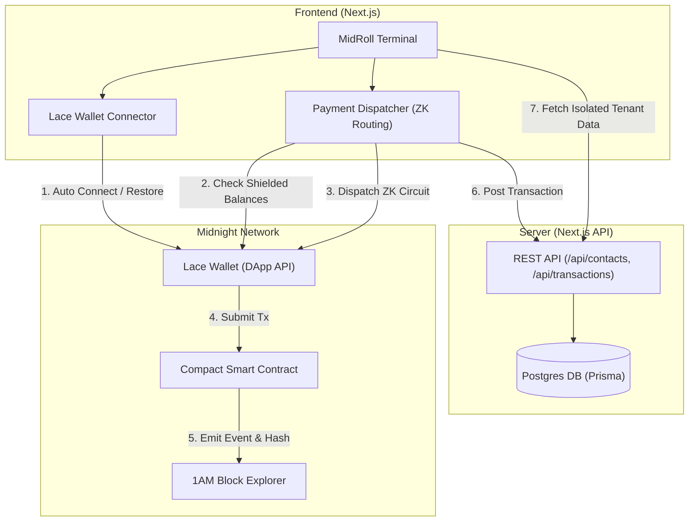
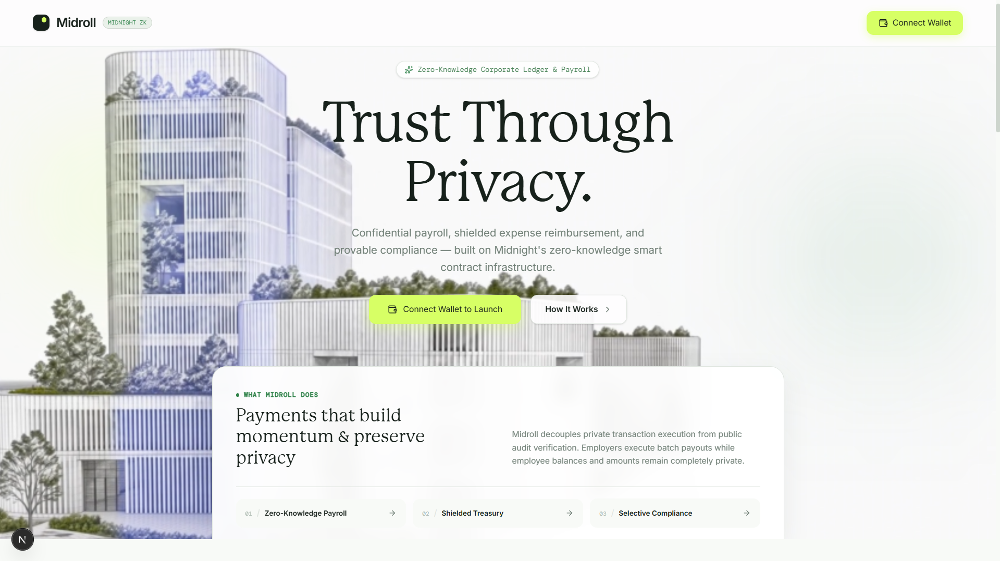
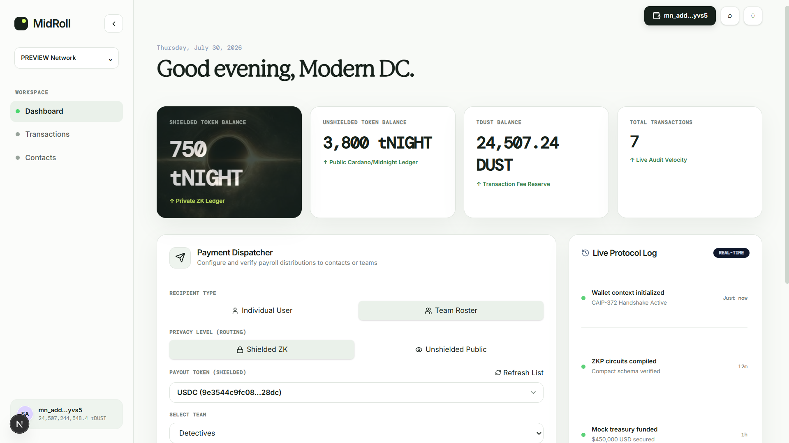
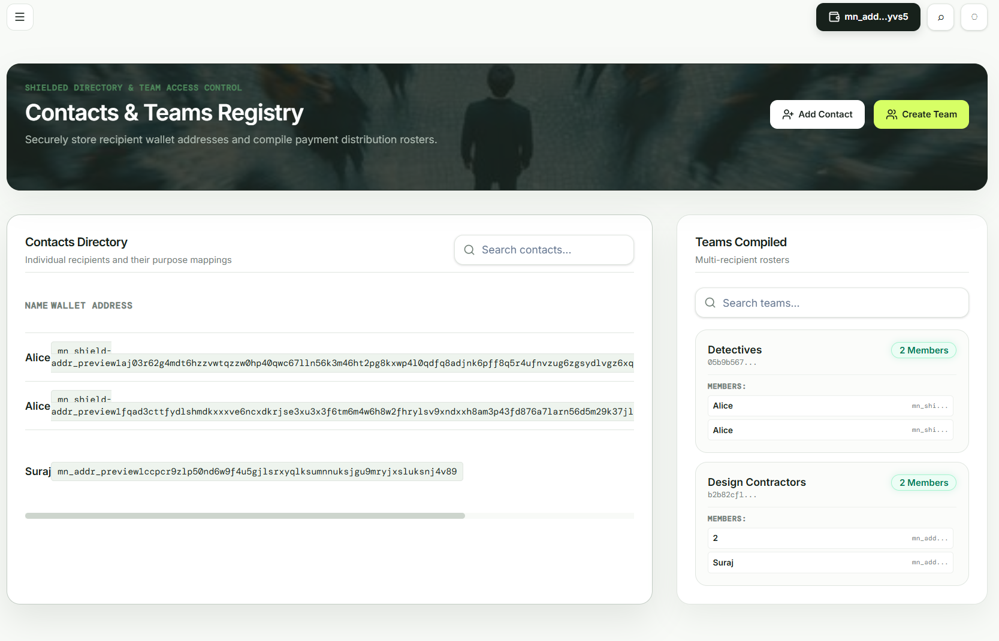
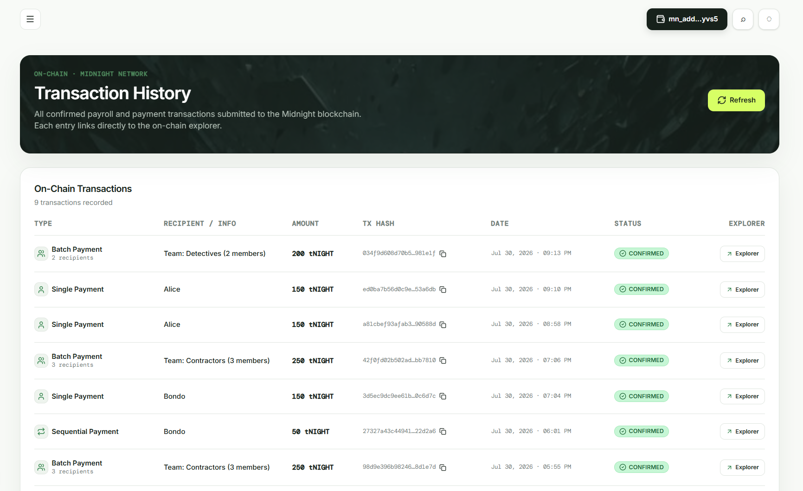
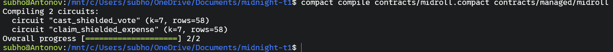
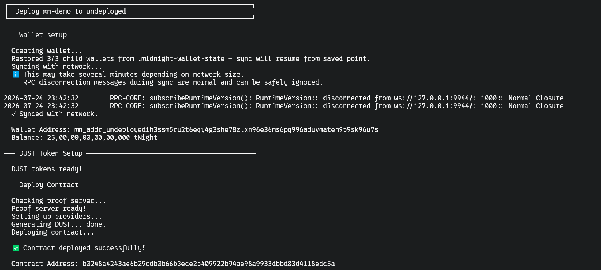
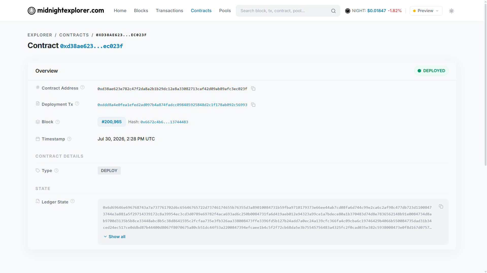

# 🛡️ MidRoll: Privacy-First Corporate Expenses & Employee Governance on Midnight

MidRoll is a next-generation corporate payroll and compliance protocol built on the Midnight blockchain, leveraging Zero-Knowledge (ZK) proofs and Compact smart contracts to ensure corporate ledger privacy while maintaining high-fidelity auditable compliance.

[](https://midroll.netlify.app/)
[](https://github.com/Subho4531/midroll)
[](https://youtu.be/6HA7Y5ENZaU)


---

## 📑 Table of Contents

- [📖 Project Description](#-project-description)
- [🎥 Video Demo](#-video-demo)
- [✨ Key Features](#-key-features)
- [🏗️ Architecture](#️-architecture)
- [📜 Smartcontract Details](#-smartcontract-details)
- [🛡️ Privacy & ZK Model](#-privacy--zk-model)
- [🚀 Run Locally & Getting Started](#-run-locally--getting-started)
- [🖼️ UI Screenshots](#️-ui-screenshots)
- [🛠️ Tech Stack](#️-tech-stack)
- [📂 Project Structure](#-project-structure)
- [🤖 CI/CD Pipeline](#-cicd-pipeline)
- [📝 Product Proposal](#-product-proposal)

---

## 📖 Project Description

MidRoll redefines how organizations manage employee finances and compliance. By integrating **Zero-Knowledge Proofs (ZKPs)** via Midnight's **Compact contract engine**, MidRoll allows employees to prove receipt compliance for expense reimbursements and check salary rosters for governance voting without disclosing sensitive raw data (like itemized purchases, merchant detail tags, salary sizes, or voter identities) on the public ledger.

---

## 🎥 Video Demo

Experience MidRoll in action:

[](https://youtu.be/6HA7Y5ENZaU)

*Watch the full walkthrough of the Privacy-First Corporate Expenses and Employee Governance on Midnight.*

---

## ✨ Key Features

- **🔐 Privacy via ZK Proofs**: Receipt compliance verification checks (receipt amount <= category threshold) run locally. Treasury reimburses to stealth addresses without publishing itemized merchant receipts or personal cards on-chain.
- **💎 Dynamic Shielded Token Selection**: Integrates `getShieldedBalances` to query available shielded tokens in the Lace wallet dynamically, defaulting to custom USDC (`9e3544c9fc085f2be9625c3be78ce82a3cb3c5a946bbbf7553a21781ae4628dc`).
- **🔒 Company Multi-Tenant Isolation**: Roaster contacts, corporate teams, and on-chain logs are partitioned by the company connected `walletAddress` to enforce complete data privacy from other corporate tenants.
- **🛡️ Pending Transaction Recovery**: Handles indexer lag. Approved transactions are saved with a `PENDING` state and automatically synced/resolved chronologically against the connected wallet history on subsequent visits.
- **⚡ Auto-Connect & Redirect**: Connection persistence remembers your wallet connectivity; automatically connects on mount and redirects you directly to the `/dashboard`.

---

## 🏗️ Architecture



---

## 📜 Smartcontract Details

MidRoll's core logic is governed by a Compact smart contract deployed on the Midnight Preview Testnet.

- **Contract Address**: `d38ae623e782c47f2da8a2b1b29dc12e8a33082713caf42d09ab89afc3ec023f`
- **Network**: Midnight Preview Testnet
- **Explorer URL**: [https://explorer.1am.xyz/tx/d38ae623e782c47f2da8a2b1b29dc12e8a33082713caf42d09ab89afc3ec023f](https://explorer.1am.xyz/tx/d38ae623e782c47f2da8a2b1b29dc12e8a33082713caf42d09ab89afc3ec023f)

---

## 🛡️ Privacy & ZK Model

### - PUBLIC:
- `treasury_commitment`: Hash commitment of corporate payroll treasury pool.
- `nullifier_root`: Set of spent nullifiers preventing double-claiming expenses & double-voting.
- `active_proposals_count`: Total active DAO governance polls.
- `aggregate_expense_disbursed`: Cumulative verified reimbursement payout.

### - PRIVATE:
- `salary_amount_cents`: Employee's raw monthly compensation rate.
- `employee_secret_key`: Secret key used for signing client-side ZK proofs.
- `receipt_itemized_details`: Raw itemized purchase items and merchant credit card data.
- `whistleblower_identity`: Employee name, IP address, and wallet address.

### - PROVED without revealing:
- Proves receipt total <= category policy limit.
- Proves active payroll membership to cast anonymous governance votes.
- Proves nullifier has not been spent previously.

### - Privacy Claim:
What an on-chain observer sees vs cannot see.
An on-chain observer can only see that a valid ZK transaction was executed, that the contract state commitment has updated, and that a proof has been successfully verified. An observer **cannot** see the worker's wallet address, the itemized receipt contents, the merchant's credit card information, the voter's identity, or the whistleblower's personal details.

---

## 🚀 Run Locally & Getting Started

### Prerequisites
- Lace Wallet browser extension installed (configured for Midnight Network)
- Node.js v22
- Docker (for local dev proof-server container)

### Setup & Installation

1. **Clone the repository**:
   ```bash
   git clone https://github.com/Subho4531/midroll.git
   cd midroll
   ```

2. **Install dependencies**:
   ```bash
   npm install
   ```

3. **Start local Devnet Proof Server & Node**:
   ```bash
   npm run proof-server:start
   ```

4. **Deploy the Smart Contract**:
   To deploy to the local Devnet:
   ```bash
   npm run deploy
   ```
   To deploy to the public Preview network:
   ```bash
   npm run deploy --network preview
   ```

5. **Run the local development server**:
   ```bash
   npm run dev
   ```
   Open [http://localhost:3000](http://localhost:3000) in your browser.

### Run Tests
We have three test suites verifying the full lifecycle of MidRoll:
- **Contract ZK Tests:** Validates smart contract zero-knowledge logic, employee payroll active-status checks, double-claim nullifiers, and verifies that private witness variables are not leaked to public ledger states.
- **Frontend Helpers Tests:** Validates custom React frontend logic, address truncation readability helper, and the chronological matcher for pending transaction sync recovery.
- **Backend/On-chain Tests:** Validates company tenant isolation parameters and database schema transaction status transitions.

```bash
npm test
```

---

## 🖼️ UI Screenshots

#### 💎 Main Landing Page


#### 🚀 Corporate Dashboard


#### 👥 Contacts Management


#### 📊 Transaction Streams & Ledgers


#### 📱 Responsive Design (Mobile Ready)


#### 🛠️ Soroban/Soroban-equivalent Compact Compiling


#### ⛓️ Contract On-Chain Deployment


#### 🔍 1AM Block Explorer Verification


---

## 🛠️ Tech Stack
MidRoll is built using a modern, high-performance stack optimized for security and scale.

- **Frontend**: Next.js, Tailwind CSS, Framer Motion, Lenis Scroll
- **Blockchain**: Midnight Network, Compact ZK Smart Contracts, Midnight.js SDK, Lace Wallet
- **Backend**: Node.js, Next.js API Routes, Prisma
- **Database**: PostgreSQL (Aiven Cloud Instance)
- **Testing**: Vitest

---

## 📂 Project Structure

```text
├── .github/workflows/ # GitHub Actions CI/CD workflows
├── contracts/         # Compact Smart Contracts & managed compiled output
├── screenshots/       # Visual tour images & assets
├── scripts/           # Deployment & configuration maintenance CLI scripts
├── src/               # Next.js Source Code
│   ├── app/           # App Router (Pages, UI shells, & REST API routes)
│   ├── components/    # Reusable React UI layouts & dashboard tables
│   ├── hooks/         # Custom hooks (Midnight DApp connector integration)
│   └── lib/           # Context providers (Lace connection) & DB Client
└── tests/             # Contract, Frontend, and Backend Vitest suites
```

---

## 🤖 CI/CD Pipeline

The CI/CD pipeline is configured via GitHub Actions in [.github/workflows/ci.yml](file:///.github/workflows/ci.yml).
- **Triggers:** On every push or pull request to the `master` and `main` branches.
- **Pipeline Structure:**
  1. **contracts (Build and Test Contracts):** Checks out code, sets up Node.js v22, downloads the official Midnight compact compiler CLI, runs `compact update` to set the default compiler, runs the contract ZK circuit verification tests, compiles the Compact smart contracts, and uploads the compilation files as a workflow artifact (`contract-artifacts`).
  2. **frontend (Build and Test APP):** Runs concurrently with database service integration. Pulls down `postgres:15` container services, downloads `contract-artifacts`, generates the Prisma client, deploys migrations, runs both the Frontend and Backend tests, and builds the Next.js production bundle.
  3. **deploy (Deploy Gate):** Triggers only on merges to master/main, outputting authorization once all tests pass.

---

## 📝 Product Proposal
See [PROPOSAL.md](file:///C:/Users/subho/OneDrive/Documents/midnight-t1/PROPOSAL.md)

---
<p align="center">Made with ❤️ for the Midnight Ecosystem</p>
